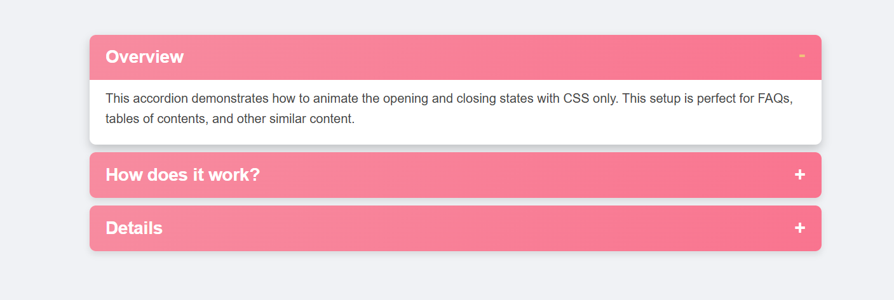

# Accordion Menu

A collection of **Accordion Menus** created using only HTML and CSS. This project showcases three different types of accordion menus based on difficulty levels: **Beginner**, **Intermediate**, and **Advanced**. Perfect for learners and developers looking to understand and implement pure CSS solutions for collapsible menus.

---

## 📖 About the Project
Accordion menus are a common UI component used to display information in a collapsible format, saving space and improving user experience. This project demonstrates how to create stylish and functional accordion menus without using JavaScript.

### Accordion Types:
1. **Beginner:** A basic accordion with simple open/close functionality.
2. **Intermediate:** A more refined design with smooth animations and hover effects.
3. **Advanced:** A fully responsive accordion with nested sections and advanced styling.

---

## 🚀 Features
### Beginner Accordion:
- Minimal design.
- Basic open/close behavior.

### Intermediate Accordion:
- Smooth CSS transitions.
- Improved styling and hover effects.

### Advanced Accordion:
- Responsive design for various screen sizes.
- Nested accordions for complex layouts.
- Advanced animations and custom styling.

---

## 📂 Project Structure
- **index.html:** Contains the structure for all three accordion types.
- **style.css:** Contains the CSS styles for the accordion menus.

---

## 🛠️ Tools & Technologies
- **HTML5**: For structuring the accordion menus.
- **CSS3**: For styling, transitions, and animations.

---

## 🔍 How It Works
### CSS Techniques Used:
- **Checkbox Hack:** Utilized in the beginner accordion to toggle sections.
- **Transitions:** Smooth open/close animations for intermediate and advanced accordions.
- **Flexbox/Grid:** For responsive layouts in the advanced accordion.
- **Nested Selectors:** For handling nested accordions.

---

## 🛡️ License
This project is licensed under the [MIT License](LICENSE). Feel free to use, modify, and distribute the code as per the license terms.

---

## 📢 Feedback
Have suggestions or improvements? Feel free to open an issue or contact us. We appreciate your feedback!

---

Happy coding! 💻✨
