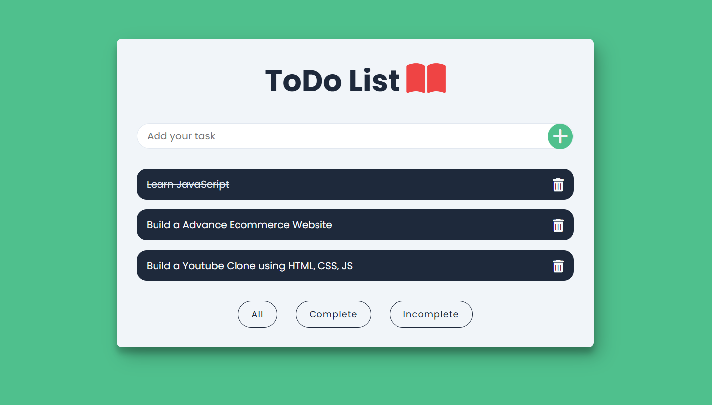

# Advanced Todo App with LocalStorage

An **Advanced Todo App** built using HTML, CSS, and JavaScript, featuring LocalStorage support, task status filters (All, Completed, Incomplete), and a beautiful responsive design.

---

## 📖 About the Project
This project is an improved version of a Todo application that allows users to manage their tasks efficiently. It supports **LocalStorage**, ensuring that tasks are saved even after refreshing the page. Users can filter tasks based on their completion status.

---

## 🚀 Features
- **Add & Remove Tasks:** Users can easily add and delete tasks.
- **Mark Tasks as Completed:** Click to mark tasks as completed with a strike-through effect.
- **LocalStorage Support:** Saves tasks even after closing the browser.
- **Filter Tasks:** View **All**, **Completed**, or **Incomplete** tasks.
- **Fully Responsive Design:** Works seamlessly on all devices.
- **Beautiful UI:** Clean, user-friendly interface with smooth animations.

---

## 📂 Project Structure
- **index.html:** Provides the structure of the Todo App.
- **style.css:** Adds styling and responsiveness.
- **script.js:** Handles task actions, filtering, and LocalStorage functionality.

---

## 🛠️ Tools & Technologies
- **HTML5:** For structuring the app layout.
- **CSS3:** For styling, animations, and responsiveness.
- **JavaScript:** For handling task actions, filters, and saving data in LocalStorage.

---

## 🔍 How It Works
1. Enter a task in the input field and add it to the list.
2. Click on a task to mark it as completed.
3. Use the **filter buttons** to toggle between **All, Completed, and Incomplete** tasks.
4. Click the delete button to remove a task.
5. All tasks are saved in LocalStorage for future access.

---

## 🛡️ License
This project is licensed under the [MIT License](LICENSE). Feel free to use, modify, and distribute the code.

---

Stay productive with this **Advanced Todo App**! ✅🔥