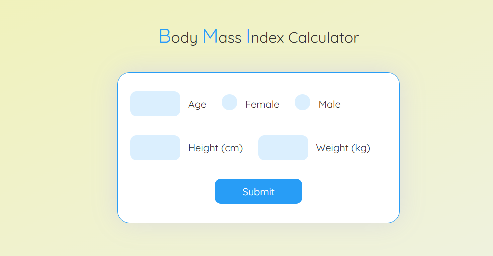

# BMI Calculator

A simple **Body Mass Index (BMI) Calculator** built using JavaScript. This project helps users calculate their BMI based on their height and weight and provides a health status interpretation based on the result.

---

## 📖 About the Project
The BMI Calculator is an interactive web application that allows users to:
- Enter their height (in cm or meters) and weight (in kg).
- Calculate their BMI instantly.
- Get an interpretation of their BMI, such as "Underweight," "Normal," "Overweight," or "Obese."

This project is beginner-friendly and serves as a practical example of using JavaScript for real-world applications.

---

## 🚀 Features
- User-friendly interface.
- Real-time BMI calculation.
- Health category interpretation.
- Responsive design for mobile and desktop users.

---

## 📂 Project Structure
- **index.html:** The main HTML file containing the structure of the app.
- **style.css:** CSS file for styling the BMI Calculator.
- **script.js:** JavaScript file for the BMI calculation logic and event handling.

---

## 🛡️ License
This project is licensed under the [MIT License](LICENSE). You are free to use, modify, and distribute this project as per the license terms.

---

## 📢 Feedback
If you have any feedback or suggestions, feel free to open an issue or contact us. We value your input!

---

Happy coding! 💻✨
