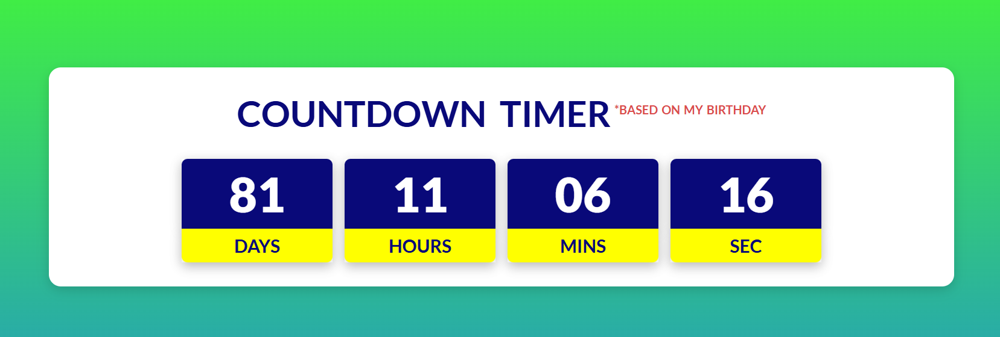

# Countdown Timer

A fully functional **Countdown Timer** built using HTML, CSS, and JavaScript. This project provides a sleek, responsive timer that allows users to count down to a specific date and time.

---

## 📖 About the Project
The Countdown Timer is a dynamic web application that:
- Allows users to set a target date and time.
- Displays the remaining time in days, hours, minutes, and seconds.
- Automatically updates in real-time.

This project is great for events, launches, or any time-sensitive tasks requiring a visual countdown.

---

## 🚀 Features
- Real-time countdown updates.
- Customizable target date and time and event Birthday.
- Responsive design for seamless use across devices.
- Simple and clean user interface.

---

## 📂 Project Structure
- **index.html:** Contains the structure and markup for the countdown timer.
- **style.css:** Provides the styling for the timer, ensuring a visually appealing design.
- **script.js:** Handles the countdown logic and dynamic updates.

---

## 🛠️ Tools & Technologies
- **HTML5**: For structuring the timer's interface.
- **CSS3**: For styling and layout.
- **JavaScript**: For implementing the countdown logic and dynamic functionality.

---

## 🔍 How It Works
1. The user sets a target date and time.
2. JavaScript calculates the time difference between the current time and the target time.
3. The timer updates every second, displaying the remaining days, hours, minutes, and seconds.
4. Once the countdown reaches zero, the timer stops and can trigger an optional action (e.g., displaying a message).

---

## 🛡️ License
This project is licensed under the [MIT License](LICENSE). You are free to use, modify, and distribute the code as per the license terms.

---

## 📢 Feedback
If you have any feedback or suggestions, feel free to open an issue or contact us. Your input helps improve the project!

---

Happy coding! 💻✨
