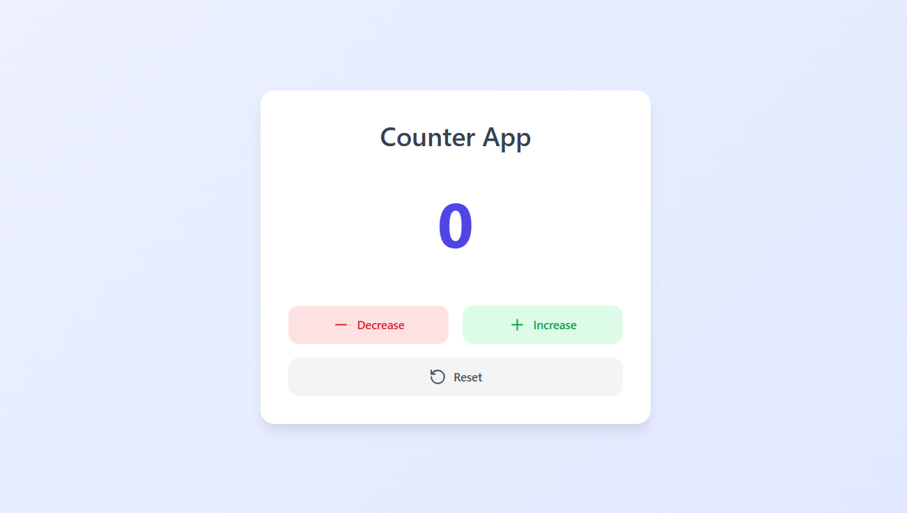

# Simple Counter App

A **Basic Counter Application** built using HTML, CSS, and JavaScript. This project helps beginners understand the fundamentals of DOM manipulation and event handling in JavaScript.

---

## 📖 About the Project
This simple app allows users to increase, decrease, and reset a counter value displayed on the screen.

---

## 🚀 Features
- **Increment Button** → Increases the counter value by 1.
- **Decrement Button** → Decreases the counter value by 1.
- **Reset Button** → Resets the counter back to zero.
- **Live Counter Display** → Shows the current count dynamically.
- **Minimalistic & Responsive Design** → Works well on all screen sizes.

---

## 📂 Project Structure
- **index.html** → Structure of the app.
- **style.css** → Styling for layout and buttons.
- **script.js** → Handles counter logic and events.

---

## 🛠️ Tools & Technologies
- **HTML5** → Structure of the application.
- **CSS3** → Basic styling for UI.
- **JavaScript** → Counter functionality and event handling.

---

## 🖼️ Preview

---

## 🛡️ License
This project is licensed under the [MIT License](LICENSE). You are free to use, modify, and distribute it.

---

Enjoy building with this **Simple Counter App**! 🎉