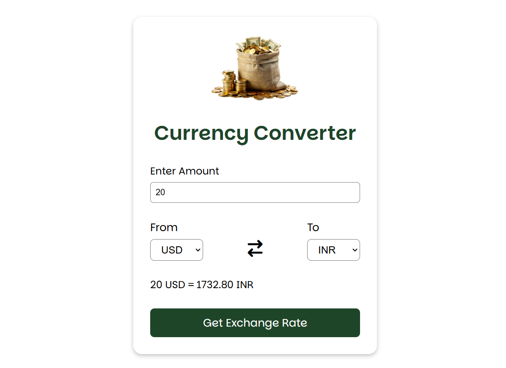

# Currency Converter

A **Currency Converter** built using HTML, CSS, and JavaScript. This project is a great way to learn **DOM manipulation** and how to **fetch data from an API** to get real-time exchange rates.

---

## 📖 About the Project
This project allows users to convert currency values from one currency to another using **live exchange rates**. The app fetches exchange rate data from an external API and updates the conversion dynamically.

---

## 🚀 Features
- **Real-Time Currency Conversion:** Fetches live exchange rates from an API.
- **User-Friendly Interface:** Simple and intuitive design for easy currency conversion.
- **Multiple Currency Support:** Convert between different global currencies.
- **Responsive Design:** Works seamlessly on all devices.
- **Basic DOM Manipulation:** Great for beginners to learn JavaScript interactions.

---

## 📂 Project Structure
- **index.html:** Provides the structure of the Currency Converter.
- **style.css:** Adds styling and responsiveness.
- **script.js:** Handles API fetching, conversion logic, and DOM updates.

---

## 🛠️ Tools & Technologies
- **HTML5:** For structuring the app layout.
- **CSS3:** For styling and responsiveness.
- **JavaScript:** For handling conversion logic and API requests.
- **Fetch API:** To get live exchange rate data from an external source.

---

## 🔍 How It Works
1. The user selects the **source currency** and **target currency** from dropdowns.
2. Enters an amount in the input field.
3. The app fetches live exchange rates using an API.
4. The converted amount is displayed dynamically.

---

## 🛡️ License
This project is licensed under the [MIT License](LICENSE). Feel free to modify and distribute it.

---

Start converting currencies in real-time! 💱✨
