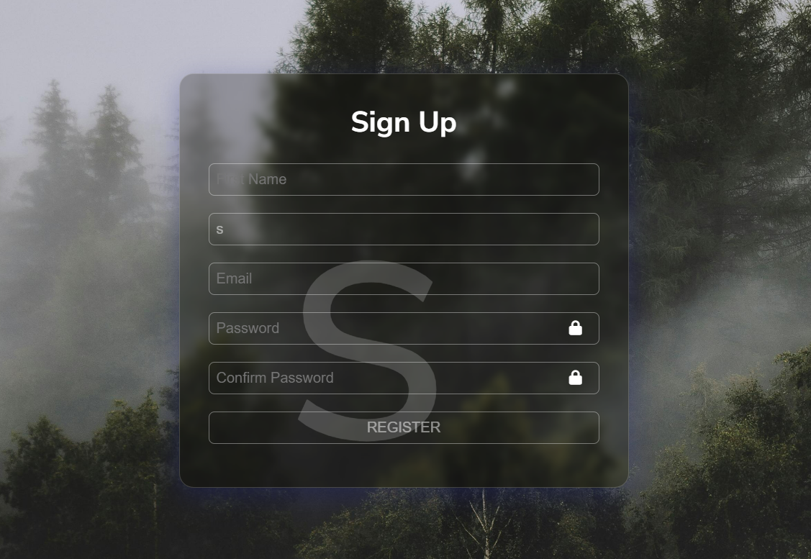

# Advanced Form Validation

An **Advanced Form Validation** project built using HTML, CSS, and JavaScript with a modern design featuring beautiful shadows. This project provides user-friendly form validation for creating secure and visually appealing web forms.

---

## 📖 About the Project
This project demonstrates how to create forms with:
- Real-time validation for inputs like email, password, phone number, etc.
- Error messages with custom styles.
- A sleek, shadow-enhanced design for an engaging user experience.

It is ideal for improving your web development skills and learning advanced form-handling techniques.

---

## 🚀 Features
- **Real-Time Validation:** Validate inputs as users type.
- **Custom Error Messages:** Inform users about invalid inputs with styled messages.
- **Beautiful Design:** Aesthetic form layout with smooth shadows.
- **Responsiveness:** Works seamlessly on all devices.

---

## 📂 Project Structure
- **index.html:** Contains the HTML structure of the form.
- **style.css:** Handles the styling, including shadows and responsive design.
- **script.js:** Implements form validation logic.

---

## 🔍 How It Works
1. Users fill out the form fields (e.g., email, password, phone number).
2. JavaScript validates the input in real-time to ensure data correctness.
3. Styled error messages appear for invalid fields, guiding users to make corrections.
4. On successful validation, the form can be submitted securely.

---

## 🛡️ License
This project is licensed under the [MIT License](LICENSE). You are free to use, modify, and distribute the code as per the license terms.

---

Happy coding! 💻✨
