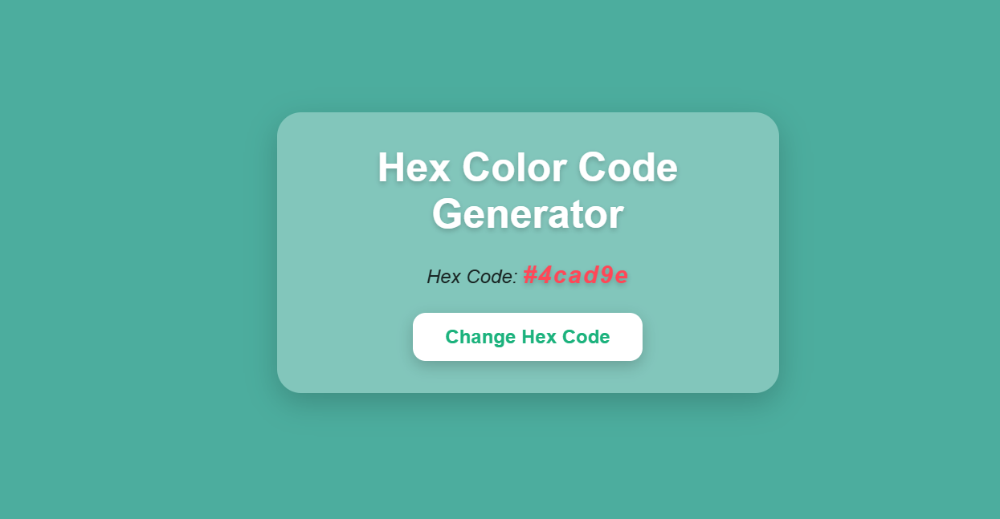

# Hex Code Generator

A **Hex Code Generator** project built using HTML, CSS, and JavaScript. This tool generates random hex color codes, applies them as the background color of the webpage, and allows users to copy the color code to the clipboard with a single click.

---

## 📖 About the Project
This project showcases how to create a dynamic and interactive color generator:
- Random hex codes generated at the click of a button.
- Automatic application of the generated color as the background.
- Easy copy-to-clipboard functionality for user convenience.

This project is a great way to understand DOM manipulation, event handling, and clipboard API usage in JavaScript.

---

## 🚀 Features
- **Random Color Generation:** Generates a unique hex color code on every button click.
- **Background Color Update:** The generated color is immediately applied to the webpage background.
- **Copy-to-Clipboard:** Users can copy the hex code to the clipboard with a single click.
- **User-Friendly Design:** Aesthetic interface for an enjoyable experience.

---

## 📂 Project Structure
- **index.html:** The HTML structure containing the button and display area for the hex code.
- **style.css:** The CSS file for styling the button, hex code display, and overall layout.
- **script.js:** JavaScript logic for generating hex codes, updating the background, and handling clipboard functionality.

---

## 🔍 How It Works
1. Click the "Generate Color" button to create a random hex code.
2. The background color of the webpage changes to the generated color.
3. Click the displayed hex code to copy it to your clipboard.

---

## 🛡️ License
This project is licensed under the [MIT License](LICENSE). You are free to use, modify, and distribute the code as per the license terms.

---

Happy coding! 💻✨
