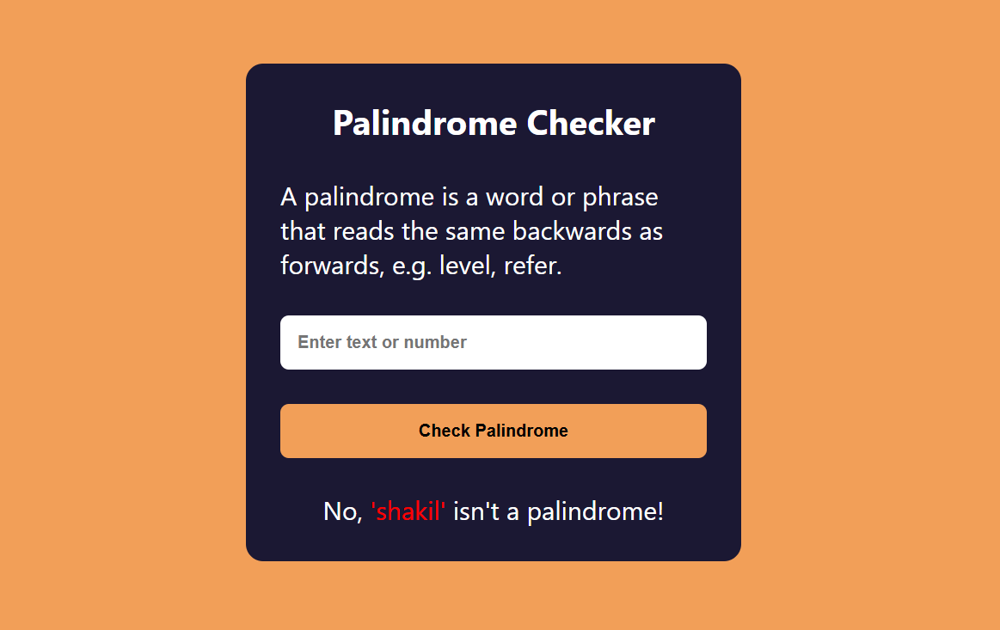

# Palindrome Checker

A **Palindrome Checker** project built using HTML, CSS, and JavaScript. This tool checks if a given word or phrase is a palindrome (reads the same forwards and backwards) and provides instant feedback to the user.

---

## 📖 About the Project
This project demonstrates a simple way to build an interactive application:
- Users can input text to check for palindromes.
- The tool removes spaces, punctuation, and ignores case while checking.
- Displays a success message for palindromes or an error message otherwise.

---

## 🚀 Features
- **Instant Check:** Provides real-time validation of the input.
- **Case-Insensitive Validation:** Ignores upper or lowercase letters.
- **Special Characters Handling:** Strips out spaces and punctuation before validation.
- **User-Friendly Design:** Clean interface for easy interaction.

---

## 📂 Project Structure
- **index.html:** Contains the HTML structure for the input field, button, and result display.
- **style.css:** Handles the styling for the form and results area.
- **script.js:** Implements the logic to check for palindromes and update the DOM accordingly.

---

## 🔍 How It Works
1. Users input a word or phrase in the text box.
2. The JavaScript logic removes non-alphanumeric characters and checks if the cleaned text reads the same forwards and backwards.
3. Displays whether the input is a palindrome or not.

---

## 🛡️ License
This project is licensed under the [MIT License](LICENSE). You are free to use, modify, and distribute the code as per the license terms.

---

Happy coding! 💻✨