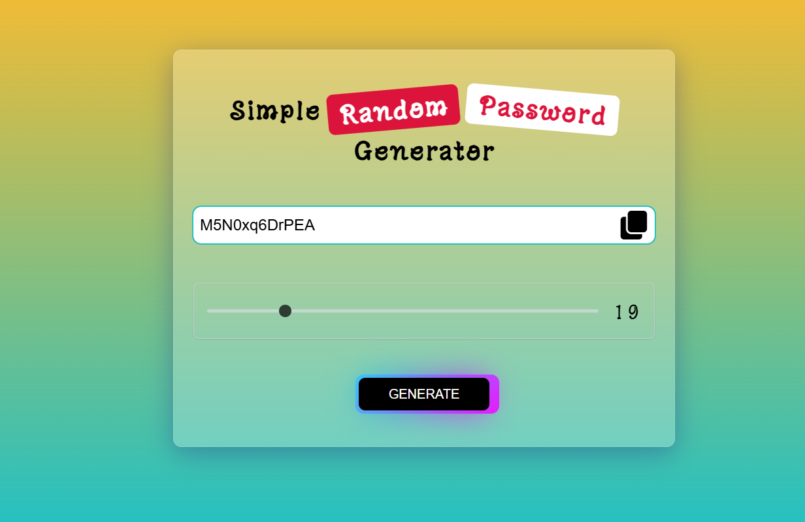

# Password Generator

A **Password Generator** project built using HTML, CSS, and JavaScript. This tool generates secure and random passwords with customizable options and features a beautiful design. Users can easily copy the generated password to their clipboard with a single click.

---

## 📖 About the Project
This project helps users create secure passwords for online accounts. With a sleek and modern interface, the generator allows users to:
- Generate passwords of customizable length.
- Include or exclude special characters, numbers, and uppercase letters.
- Copy the generated password to the clipboard with a single click.

---

## 🚀 Features
- **Customizable Options:** Choose password length and character set (letters, numbers, symbols).
- **Copy to Clipboard:** One-click copy functionality for convenience.
- **Dynamic Background:** The page dynamically updates with a visually appealing design.
- **Responsive Design:** Fully functional on desktop and mobile devices.

---

## 📂 Project Structure
- **index.html:** Provides the HTML structure for the form, buttons, and output display.
- **style.css:** Adds modern and visually appealing styles with shadow effects and dynamic colors.
- **script.js:** Implements the logic for password generation, copying to clipboard, and dynamic updates.

---

## 🔍 How It Works
1. Users select options like password length and character types.
2. JavaScript generates a random password based on the selected options.
3. The password is displayed in an output field, and users can copy it to the clipboard.

---

## 🛡️ License
This project is licensed under the [MIT License](LICENSE). You are free to use, modify, and distribute the code as per the license terms.

---

Happy coding! 💻✨
