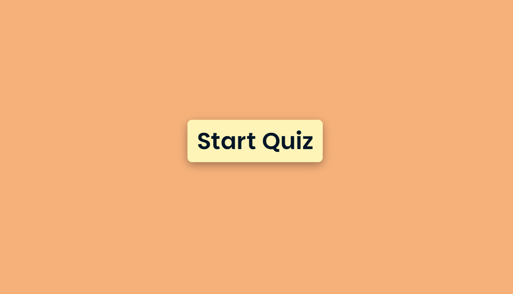
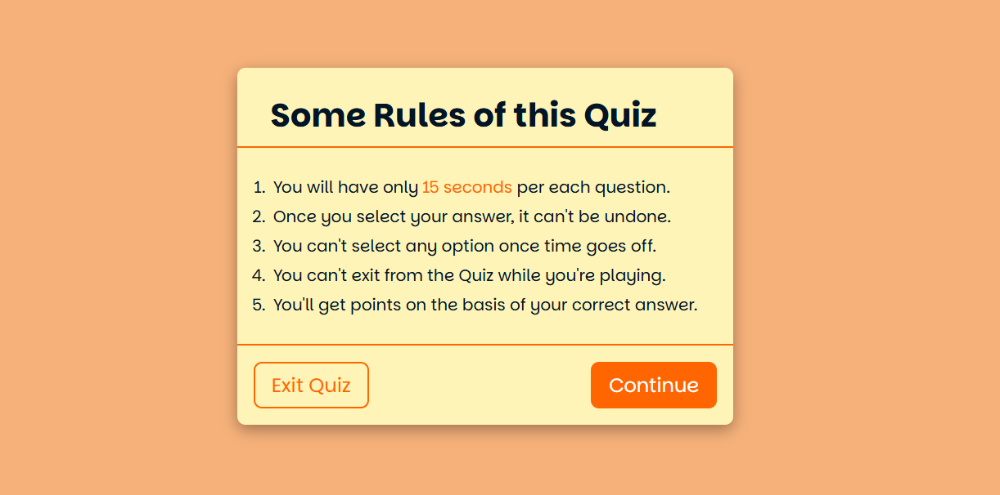
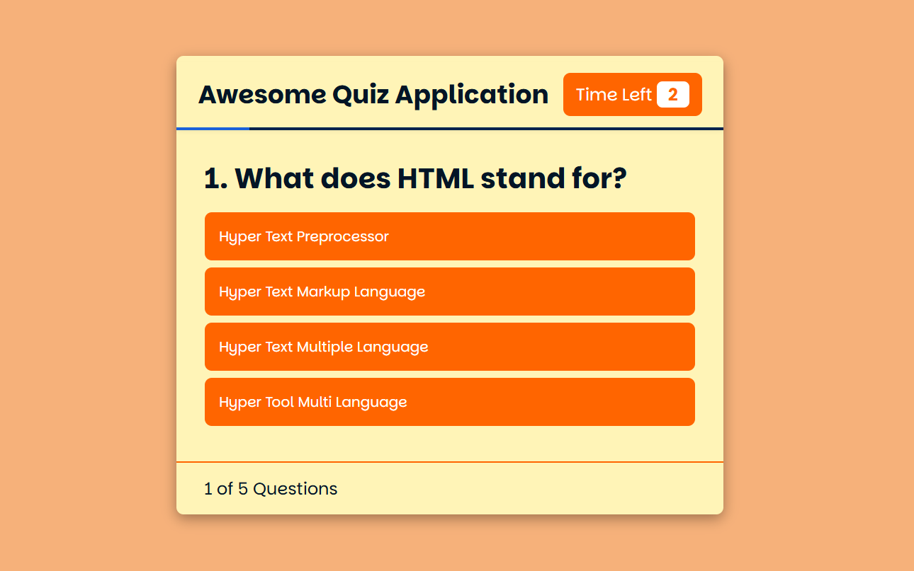
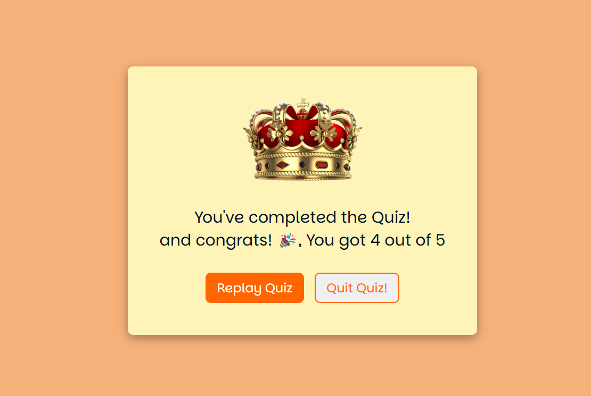

# Intermediate Quiz App

An **Interactive Quiz App** built using HTML, CSS, and JavaScript, featuring a structured quiz flow with multiple sections, timers, and user feedback.

---

## 📖 About the Project
This quiz app guides users through a seamless experience, from starting the quiz to checking their results. It includes four main sections: **Start Button, Quiz Rules, Quiz Questions, and Results/Victory Section.**

---

## 🖼️ Preview

## 🚀 Features
- **Start Button Section:** A centered button to begin the quiz.
- **Quiz Rules Section:** A modal displaying quiz instructions with **Exit** and **Continue** buttons.
  - Clicking **Exit** closes the modal.
  - Clicking **Continue** opens the main quiz.
- **Quiz Section:**
  - Displays **one question at a time**.
  - Includes a **15-second timer per question**.
  - Provides **four answer choices** per question.
- **Result/Victory Section:** Displays the total score and performance summary.
- **Responsive UI:** Works on all screen sizes.
- **Smooth Animations & Transitions:** Enhances user experience.

---

## 📂 Project Structure
- **index.html** → Structure of the app.
- **style.css** → Styles for layout, buttons, and modals.
- **script.js** → Manages quiz logic, timer, and user interactions.

---

## 🛠️ Tools & Technologies
- **HTML5** → Page structure.
- **CSS3** → Styling and responsive design.
- **JavaScript** → Quiz logic, timer, and interactions.

---

## 🔍 How It Works
1. The **Start button** launches the quiz.
2. The **Rules modal** explains the game with an **Exit** and **Continue** button.
3. The **Quiz section** presents questions with a **15-second countdown** and **four answer choices**.
4. The **Result section** displays your performance after all questions.

---

## 🛡️ License
This project is licensed under the [MIT License](LICENSE). Feel free to use, modify, and distribute it.

---

Enjoy building with this **Intermediate Quiz App**! 🎉🧠
