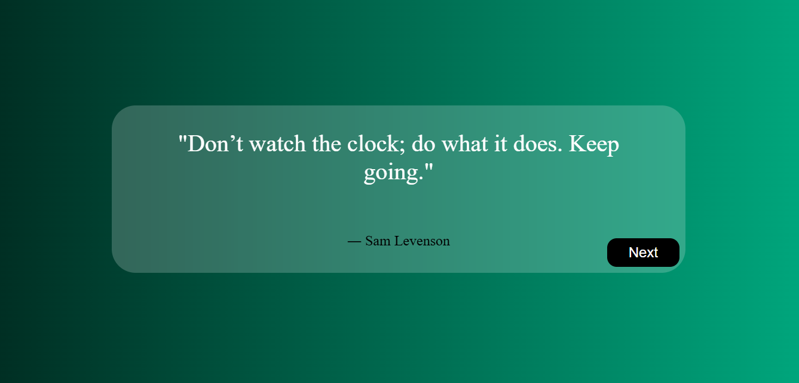

# Quotes Generator App

A **Quotes Generator App** built using HTML, CSS, and JavaScript. This simple project generates random quotes from a custom hardcoded JSON file without using any external API.

---

## 📖 About the Project
This project is a lightweight application that displays random quotes at the click of a button. Unlike many quote generators that rely on APIs, this one uses a locally stored JSON file containing a collection of inspirational quotes.

---

## 🚀 Features
- **Random Quotes:** Fetches and displays a new quote on button click.
- **No API Required:** Uses a custom hardcoded JSON file for quotes.
- **Minimal & Responsive Design:** Simple yet attractive UI with mobile-friendly styling.
- **Smooth Animations:** Provides a seamless user experience with smooth transitions.

---

## 📂 Project Structure
- **index.html:** Provides the basic structure for the app.
- **style.css:** Adds styling and shadow effects for an elegant look.
- **script.js:** Handles quote generation logic from the JSON file.

---

## 🛡️ License
This project is licensed under the [MIT License](LICENSE). You are free to use, modify, and distribute the code as per the license terms.

---

Happy coding! 💻✨
