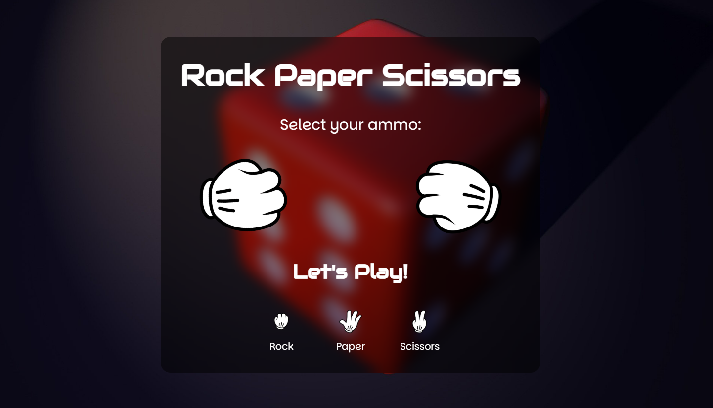

# Rock Paper Scissors Game

A **Rock Paper Scissors** game built using HTML, CSS, and JavaScript. This project features an interactive and animated design with smooth transitions and a loading effect to enhance the user experience.

---

## 📖 About the Project
This is a fun and engaging Rock Paper Scissors game where players can choose their move and compete against the computer. The game includes visually appealing animations, a dynamic UI, and a loading effect to create a seamless experience.

---

## 🚀 Features
- **Interactive Gameplay:** Play against the computer with real-time updates.
- **Smooth Animations:** Transitions and effects enhance the user experience.
- **Loading Effect:** Adds a slight delay for better engagement.
- **Responsive Design:** Works well on different screen sizes.

---

## 📂 Project Structure
- **index.html:** Contains the structure of the game.
- **style.css:** Provides styling, animations, and effects.
- **script.js:** Handles the game logic, user input, and score updates.

---

## 🔍 How It Works
1. The player selects Rock, Paper, or Scissors.
2. The computer randomly selects its move.
3. A short loading effect is displayed before showing the result.
4. The winner is determined based on classic Rock Paper Scissors rules:
   - Rock beats Scissors
   - Scissors beat Paper
   - Paper beats Rock
5. The score is updated accordingly.

---

## 🛡️ License
This project is licensed under the [MIT License](LICENSE). You are free to use, modify, and distribute the code as per the license terms.

---

Enjoy the game! 🎮✨
