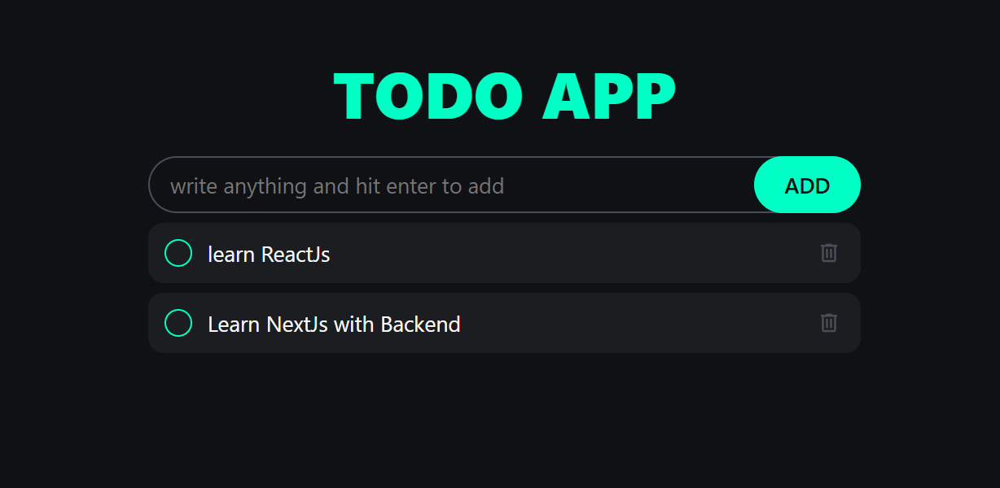

# Todo App with LocalStorage

A **Todo App** built using HTML, CSS, and JavaScript, featuring LocalStorage support for saving tasks, a fully responsive design, and a beautiful user interface.

---

## 📖 About the Project
This project is a modern Todo application that allows users to add, remove, and mark tasks as completed. The best part is that tasks are saved in **LocalStorage**, ensuring that they persist even after the page is refreshed.

---

## 🚀 Features
- **Add & Remove Tasks:** Users can add and delete tasks easily.
- **Mark Tasks as Completed:** Strike-through styling for completed tasks.
- **LocalStorage Support:** Saves tasks even after closing the browser.
- **Fully Responsive Design:** Works seamlessly on all devices.
- **Beautiful UI:** A clean and intuitive design with smooth animations.

---

## 📂 Project Structure
- **index.html:** Provides the structure of the Todo App.
- **style.css:** Adds styling and responsiveness for an elegant look.
- **script.js:** Handles task management and LocalStorage functionality.

---

## 🛠️ Tools & Technologies
- **HTML5:** For structuring the app layout.
- **CSS3:** For styling, animations, and responsiveness.
- **JavaScript:** For handling task actions and saving data in LocalStorage.

---

## 🔍 How It Works
1. Users can enter a task in the input field and add it to the list.
2. Tasks can be marked as completed by clicking on them.
3. Clicking the delete button removes a task from the list.
4. All tasks are saved in LocalStorage for future access.

---

## 🛡️ License
This project is licensed under the [MIT License](LICENSE). You are free to use, modify, and distribute the code as per the license terms.

---

Stay organized with your tasks! ✅✨
