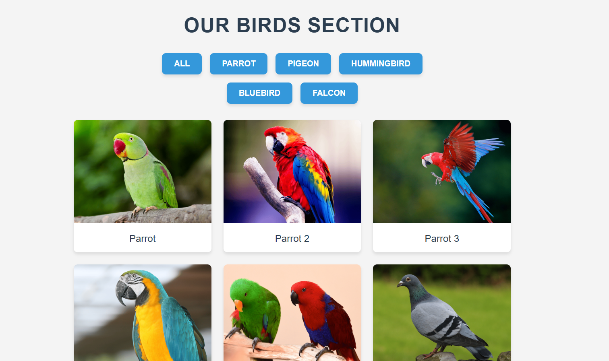

# Sorting Functionality Webpage

A **Sorting Functionality Webpage** built using HTML, CSS, and JavaScript, featuring a minimal and responsive design to filter and sort items dynamically.

---

## 📖 About the Project
This project allows users to filter and sort displayed items dynamically with smooth animations and an intuitive UI. The webpage is fully responsive and designed with a clean and modern look.

---

## 🚀 Features
- **Category-based Sorting:** Users can filter items based on predefined categories.
- **Smooth Animations:** Beautiful transition effects for sorting.
- **Minimal and Responsive Design:** Works seamlessly on all screen sizes.
- **Fast and Efficient:** Uses JavaScript for quick filtering without reloading the page.

---

## 🛠️ Tools & Technologies
- **HTML5:** For structuring the webpage.
- **CSS3:** For styling and responsive design.
- **JavaScript:** For handling filtering and sorting logic.

---

## 🛡️ License
This project is licensed under the [MIT License](LICENSE). Feel free to use, modify, and distribute the code.

---

Enjoy sorting your content dynamically! 🔍✨
